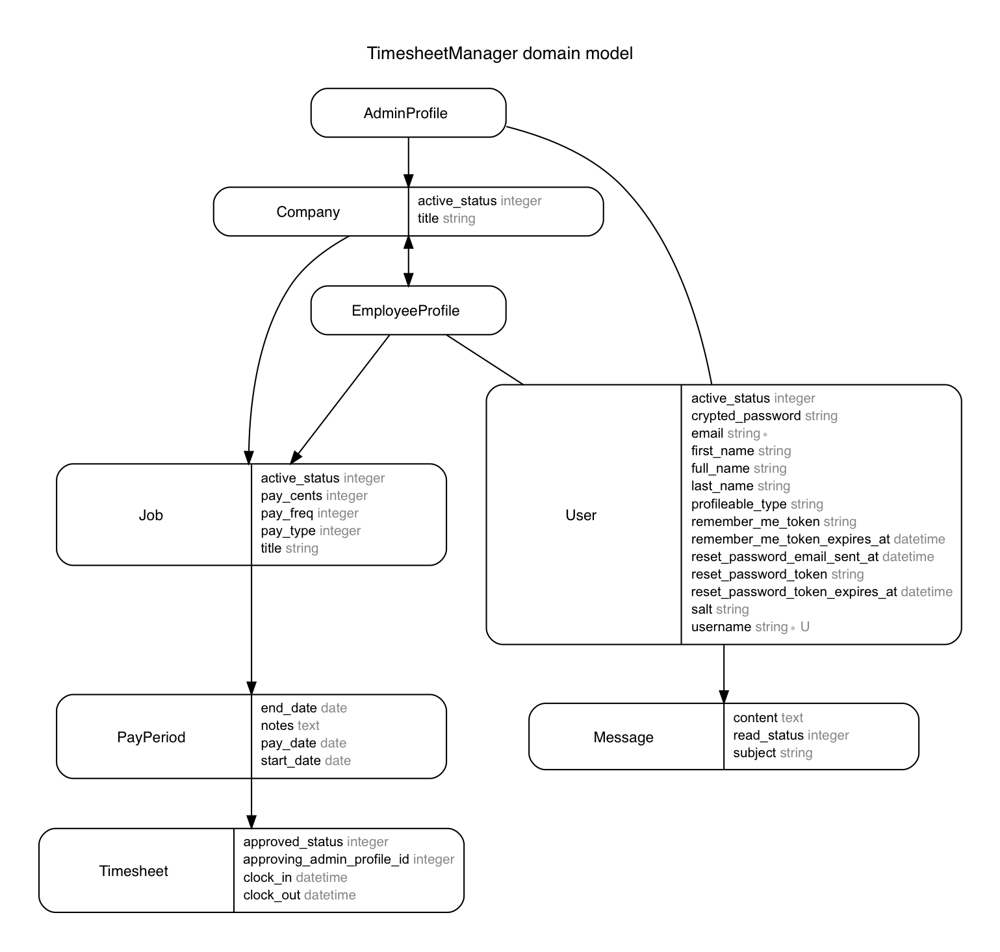

## Fountain House Timesheet Manager
#### Web app created for the [Fountain House](http://www.fountainhouse.org) organization's Employment Department for managing multiple companies, employees and jobs within those companies, creating/approving timesheets for those jobs.

Each job has its own individual pay period to meet the needs of differing pay periods and pay dates across different jobs, even within the same company, and adjustment of pay dates depending on intersection with holidays or non-work days.

A messaging system allows employees to send messages to the administrator of a company they are employed by and administrators to send messages to their employees.

